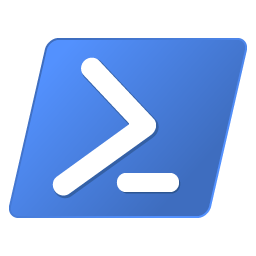

# PowerShell Resources [↩](README.md#top)

<table style="font-family:Helvetica,Arial;line-height:1.6;">
  <tr>
  <td style="border:0;padding:0 10px 0 0;min-width:100px;"></td>
  <td style="border:0;padding:0;vertical-align:text-top;">This document gathers <a href="https://www.powershell.org/" rel="external">PowerShell</a> related resources that caught our attention.
  </td>
  </tr>
</table>

## Articles

- [Tips for Writing Cross-Platform PowerShell Code](https://www.powershell.org/articles/2019-02-14-tips-for-writing-cross-platform-powershell-code/), February 2019.

## Blogs [**&#x25B4;**](#top)

- [Revisiting Join-Path in PowerShell](https://day3bits.com/2024-12-09-Revisiting-Join-Path-in-PowerShell/) by Sam Erde, December 2024.
- [No Column Name](https://nocolumnname.blog/category/powershell/) blog posts by Shane O'Neill :
   - [Ordering and Choices in PowerShell][oneill_ordering], July 2025.
   - [Initial-Choice][oneill_choice], October 2023.
   - [Only One Join-Path Is Needed][oneill_join_path], January 2022.
- [Julian West](https://blog.julianwest.me/tags/powershell/) blog posts :
   - [PowerShell Where-Object: Filtering Data in the Pipeline](https://blog.julianwest.me/ps-where-obj-piping/), December 2024.
   - [PowerShell ErrorAction and Error Handling](https://blog.julianwest.me/ps-erroraction/), August 2021.
- [Evotec](https://evotec.xyz/blog/) blog posts :
  - [Getting file metadata with PowerShell][evotec_metadata], June 2020.
- [Ironman Software][ironman] blog posts :
  - [Working with Paths in PowerShell][ironman_paths], December 2021.
- [Kevin](https://powershellexplained.com/blog) blog posts :
  - [Powershell: Building Micro Modules](https://powershellexplained.com/2019-04-11-Powershell-Building-Micro-Modules), April 2019.
  - [Powershell: Everything you wanted to know about $null](https://powershellexplained.com/2018-12-23-Powershell-null-everything-you-wanted-to-know/), December 2018.
- [PowerShell is fun :)](https://powershellisfun.com/) blog posts by Harm Veenstra :
  - [Create executables of PowerShell scripts][isfun_executables], May 2026.
  - [PowerShell v7.6 LTS Release and why it matters][isfun_lts], March 2026.
  - [PowerShell and logging][isfun_logging], July 2022.
- [**Script***Runner*](https://www.scriptrunner.com/blog) blog posts :
  - [Exploring Useful .NET Types – Part 4](https://www.scriptrunner.com/blog-admin-architect/exploring-dotnet-numeric-types-powershell-part-4) by Aleksandar Nilolic and Tobias Weltner, January 2026.
  - [Exploring Useful .NET Types – Part 3](https://www.scriptrunner.com/blog-admin-architect/exploring-dotnet-numeric-types-powershell-part-3) by Aleksandar Nilolic and Tobias Weltner, January 2026.
  - [Exploring Useful .NET Types – Part 2](https://www.scriptrunner.com/blog-admin-architect/exploring-useful-dotnet-types-part-2) by Aleksandar Nilolic and Tobias Weltner, January 2026.
  - [Exploring Useful .NET Types – Part 1](https://www.scriptrunner.com/blog-admin-architect/exploring-useful-dotnet-types-powershell-part-1) by Aleksandar Nilolic and Tobias Weltner, December 2025.
  - [PowerShell 7 vs 5.1: Should You Make the Switch?](https://www.scriptrunner.com/blog-admin-architect/switching-to-powershell-7) by Philip Lorenz, July 2024.
- [**4**sysops]()
  - [PowerShell v5 vs. PowerShell v7—Which to use and when](https://4sysops.com/archives/powershell-v5-and-v7which-to-use-and-when/) by Timothy Warner, December 2020.
- [Sheehans](https://blog.sheehans.org/) blog posts :
  - [PowerShell: Taking Control of CTRL-C][sheehan_ctrl_c], October 2018.
  - [Tracking and Controlling PowerShell Script Execution Progress via XML][sheehan_xml], October 2018.
- [Varonis](https://www.varonis.com/blog) blog posts :
  - [PowerShell Variable Scope Guide: Using Scope in Scripts and Modules](https://www.varonis.com/blog/powershell-variable-scope) by Jeff Brown, October 2022.
  - [The Difference Between Bash and Powershell](https://www.varonis.com/blog/the-difference-between-bash-and-powershell) by Michael Buckbee, June 2022.
  - [PowerShell Array Guide: How to Use and Create](https://www.varonis.com/blog/powershell-array) by Michael Buckbee, June 2022.
  - [How to Connect to Office 365 PowerShell: Azure AD Modules](https://www.varonis.com/blog/connect-to-office-365-powershell) by Jeff Brown, February 2022.
- [Willis](https://xainey.github.io/#blog) blog posts :
  - [Hitchhikers Guide to the PowerShell Module Pipeline][willis_pipeline], January 2017.
  - [Powershell v5 Classes & Concepts][willis_v5], August 2016.

<!--=======================================================================-->

## News [**&#x25B4;**](#top)

- [**reddit**](https://www.reddit.com/) &ndash; [r/PowerShell](https://www.reddit.com/r/PowerShell/)

## Tools [**&#x25B4;**](#top)

- [**dbatools**][dbatools] &ndash; the PowerShell toolkit for SQL Server professionals.

## Tutorials [**&#x25B4;**](#top)

- [PowerShell Snippets](https://jonlabelle.com/snippets/language/powershell)

## User groups [**&#x25B4;**](#top)

- [PowerShell UsergroupAustria](https://www.powershell.co.at/).

***

*[mics](https://lampwww.epfl.ch/~michelou/)/June 2026* [**&#9650;**](#top)
&nbsp;

<!-- link refs -->
[dbatools]: https://dbatools.io/
[evotec_metadata]: https://evotec.xyz/blog/getting-file-metadata-with-powershell-similar-to-what-windows-explorer-provides/
[ironman]: https://blog.ironmansoftware.com/
[ironman_paths]: https://blog.ironmansoftware.com/powershell-paths/
[isfun_executables]: https://powershellisfun.com/2026/05/22/create-executables-of-powershell-scripts/
[isfun_logging]: https://powershellisfun.com/2022/07/31/powershell-and-logging/
[isfun_lts]: https://powershellisfun.com/2026/03/20/powershell-v7-6-lts-release-and-why-it-matters/
[oneill_choice]: https://nocolumnname.blog/2023/10/10/initialize-choice/
[oneill_join_path]: https://nocolumnname.blog/2022/01/25/only-one-join-path-is-needed/
[oneill_ordering]: https://nocolumnname.blog/2025/07/21/ordering-and-choices-in-powershell/
[sheehan_ctrl_c]: https://blog.sheehans.org/2018/10/27/powershell-taking-control-over-ctrl-c/
[sheehan_xml]: https://blog.sheehans.org/2018/06/10/tracking-and-controlling-powershell-script-execution-via-xml/
[willis_pipeline]: https://xainey.github.io/2017/powershell-module-pipeline/
[willis_v5]: https://xainey.github.io/2016/powershell-classes-and-concepts/
